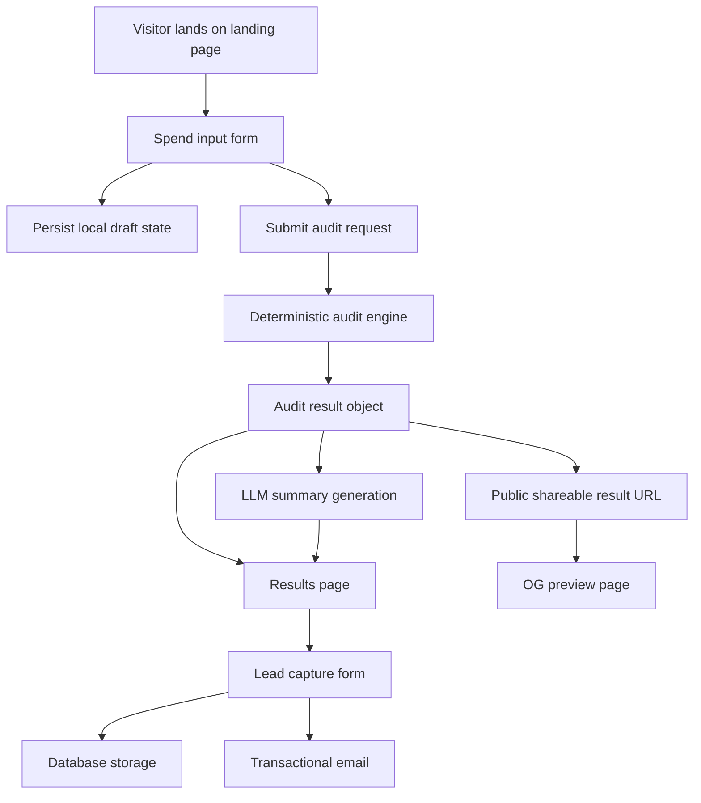

# Architecture

## System diagram

## Data flow

1. A cold visitor enters their AI tool stack, plans, monthly spend, seat counts, team size, and primary use case.
2. The form state is stored locally so reloads do not wipe progress.
3. On submit, the app sends normalized input into a deterministic audit engine.
4. The engine compares the user’s current stack against a pricing dataset and a set of usage-fit rules.
5. The output includes per-tool recommendations, monthly savings, annual savings, and a lead-priority flag.
6. The result is rendered immediately, then summarized by an LLM with a safe fallback template if the model fails.
7. If the user wants the report captured, their contact details are stored in the backend and a transactional email is sent.
8. A sanitized public result page is created for sharing without exposing private fields like email or company name.

## Planned stack

React + TypeScript + Vite is the current planned stack because it is fast to scaffold, easy to deploy, and gives enough flexibility to build a polished landing page plus an interactive audit workflow without overcommitting to a heavier framework. TypeScript is preferred here because the audit engine will benefit from explicit plan and pricing types.

Tailwind CSS is the current styling choice because it speeds up layout and polish while keeping component styles easy to iterate on within a one-week build window.

Supabase is the likely backend choice because it covers database needs quickly and is a practical fit for storing leads and audit snapshots.

## Day 1 assumptions

- The first version will use a client-rendered app with API routes or lightweight serverless endpoints for persistence and email.
- The audit engine should be written as a pure, testable module independent of UI components.
- Pricing data should live in a structured local file plus a human-readable `PRICING_DATA.md` source document.

## What changes at 10k audits/day

- Move pricing rules and audit execution behind a dedicated backend service
- Add caching for public result pages and OG image generation
- Introduce durable job handling for email sending and summary generation
- Add backend rate limiting and telemetry
- Separate analytics, lead capture, and public result storage concerns more clearly

